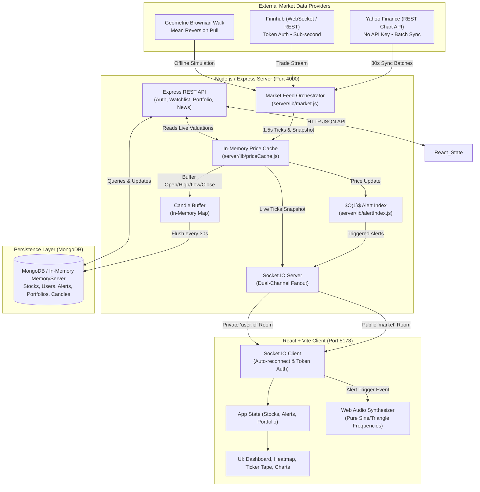
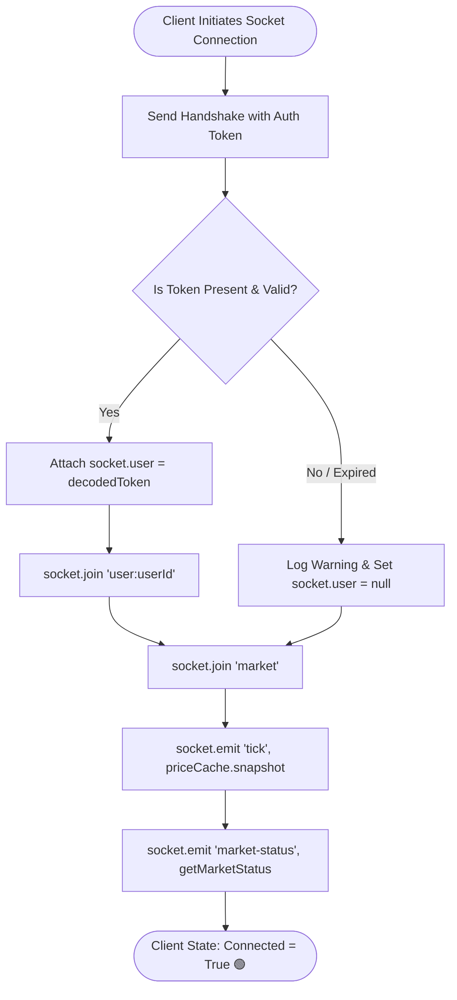
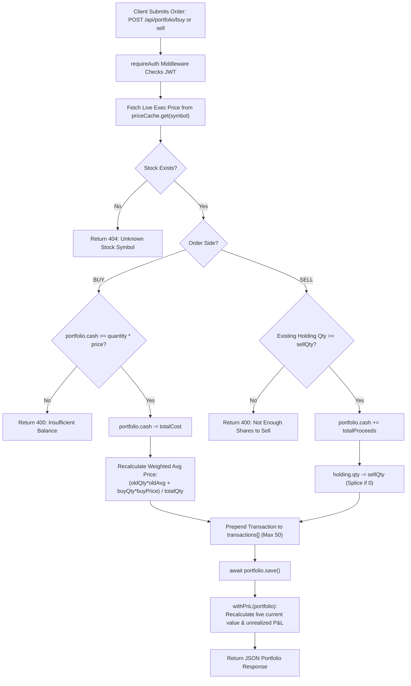

# ⚡ TICKER ROOM — Comprehensive Codebase Deep Dive & Technical Architecture

> **A technical dissection of the Ticker Room real-time market engine, data streaming pipeline, in-memory caching architecture, paper trading execution engine, flowcharts, and technical interview preparation guide.**

---

## 📑 Table of Contents
1. [Executive Overview & Purpose](#1-executive-overview--purpose)
2. [End-to-End System Architecture](#2-end-to-end-system-architecture)
3. [Core Backend Engine Deep Dive](#3-core-backend-engine-deep-dive)
   - [A. In-Memory Price Cache (`priceCache.js`)](#a-in-memory-price-cache-pricecachejs)
   - [B. Market Loop & Hybrid Ingestion (`market.js`)](#b-market-loop--hybrid-ingestion-marketjs)
   - [C. $O(1)$ Alert Index Engine (`alertIndex.js`)](#c-o1-alert-index-engine-alertindexjs)
   - [D. Dual-Channel Socket.IO Fan-Out (`index.js` & `auth.js`)](#d-dual-channel-socketio-fan-out-indexjs--authjs)
   - [E. Marked-to-Market Paper Trading Engine (`portfolioRoutes.js`)](#e-marked-to-market-paper-trading-engine-portfolioroutesjs)
   - [F. Database Layer & Zero-Config In-Memory Fallback (`mongo.js`)](#f-database-layer--zero-config-in-memory-fallback-mongojs)
4. [Interactive Architecture Flowcharts](#4-interactive-architecture-flowcharts)
   - [Flowchart 1: Real-Time Market Tick Loop & Candle Aggregation](#flowchart-1-real-time-market-tick-loop--candle-aggregation)
   - [Flowchart 2: WebSocket Connection, Auth, and Room Routing](#flowchart-2-websocket-connection-auth-and-room-routing)
   - [Flowchart 3: $O(1)$ Alert Evaluation & Real-Time Audio Delivery](#flowchart-3-o1-alert-evaluation--real-time-audio-delivery)
   - [Flowchart 4: Paper Trading & Portfolio Marked-to-Market Valuation](#flowchart-4-paper-trading--portfolio-marked-to-market-valuation)
5. [Frontend Client Architecture](#5-frontend-client-architecture)
   - [Reactive State & Socket Resilience (`App.jsx` & `socket.js`)](#reactive-state--socket-resilience-appjsx--socketjs)
   - [Zero-Dependency Web Audio Synthesizer (`audio.js`)](#zero-dependency-web-audio-synthesizer-audiojs)
   - [Dynamic Sector Heatmaps & Recharts Analytics](#dynamic-sector-heatmaps--recharts-analytics)
   - [Client-Side CSV Stream Generation (`exportCsv.js`)](#client-side-csv-stream-generation-exportcsvjs)
6. [Comprehensive Technical Interview Q&A](#6-comprehensive-technical-interview-qa)
   - [Category 1: System Design & Real-Time Scalability](#category-1-system-design--real-time-scalability)
   - [Category 2: Concurrency, Node.js Event Loop & Networking](#category-2-concurrency-nodejs-event-loop--networking)
   - [Category 3: Data Structures & Algorithmic Optimizations](#category-3-data-structures--algorithmic-optimizations)
   - [Category 4: Database Modeling & Write-Amplification Prevention](#category-4-database-modeling--write-amplification-prevention)
   - [Category 5: React Performance & Frontend Resilience](#category-5-react-performance--frontend-resilience)

---

## 1. Executive Overview & Purpose

**Ticker Room** is a full-stack, institutional-grade real-time market data platform and paper trading simulator. Built on the MERN stack (MongoDB, Express, React, Node.js) with Socket.IO and Vite, it solves the classic engineering challenges of **high-frequency market streaming, write amplification, and responsive client updates**.

### Key Architectural Highlights
* **Sub-1.5s Real-Time Market Feed**: Uses a hybrid architecture supporting zero-config Yahoo Finance live data, native Finnhub WebSockets, and an offline Geometric Brownian Motion random walk simulation.
* **In-Memory Hot Path**: Decouples high-frequency 1.5s price calculations from the disk-based database. Mongo is only written to on an aggregated 30s cadence.
* **$O(1)$ Alert Lookup Engine**: Completely avoids scanning thousands of database alert rows on every tick by maintaining an in-memory symbol hash bucket index.
* **Dual-Channel WebSocket Routing**: Separates public market price broadcasts (`market` room) from private user price alerts (`user:${userId}` room).
* **Marked-to-Market Paper Trading**: Live calculations of real-time unrealized P&L, weighted average cost accounting, and portfolio analytics across 37 equities.

---

## 2. End-to-End System Architecture



---

## 3. Core Backend Engine Deep Dive

### A. In-Memory Price Cache (`priceCache.js`)
* **File Location**: [`server/lib/priceCache.js`](file:///c:/Users/DELL/Downloads/stock-market-dasboard/server/lib/priceCache.js)
* **Design Philosophy**: High-frequency ticks touch 37 stocks every 1,500ms. Hitting MongoDB at this cadence would cause extreme write amplification, connection pool exhaustion, and CPU saturation.
* **Internal Data Structure**:
  ```javascript
  const cache = new Map(); // symbol -> { symbol, name, sector, price, prevClose, history: [{t, p}] }
  ```
* **Ring-Buffer History**: Keeps a rolling window of the last 120 ticks (`HISTORY_LIMIT = 120`), ensuring instant chart hydration without disk access.
* **Geometric Brownian Motion with Mean Reversion**:
  ```javascript
  function randomWalk(price, prevClose) {
    const meanReversion = prevClose ? (prevClose - price) * 0.0015 : 0;
    const shock = (Math.random() - 0.498) * price * 0.005;
    return Math.max(1, Number((price + meanReversion + shock).toFixed(2)));
  }
  ```
  This creates ultra-realistic price behavior: a slight drift pull towards yesterday's close combined with high-frequency micro-volatility shocks.

---

### B. Market Loop & Hybrid Ingestion (`market.js`)
* **File Location**: [`server/lib/market.js`](file:///c:/Users/DELL/Downloads/stock-market-dasboard/server/lib/market.js)
* **Drift-Free Scheduling**: Instead of `setInterval` (which accumulates timer drift and can cause cascading execution under CPU load), the engine uses recursive `setTimeout`:
  ```javascript
  async function tick() {
    try {
      tickCount += 1;
      priceCache.tickAll();
      const snapshot = priceCache.snapshot();
      io.to("market").emit("tick", snapshot);
      // evaluate alerts and update candle buffer...
    } finally {
      setTimeout(tick, TICK_MS); // Exactly 1500ms gap after completion
    }
  }
  ```
* **Candle Buffering & Periodic Flushes**:
  * As prices fluctuate, `updateCandleBuffer(symbol, price)` updates high, low, close, and tick volume.
  * Every 20 ticks (~30 seconds), `flushCandlesAndPrices()` persists aggregate 30-second OHLCV candles to MongoDB using `bulkWrite`/`updateOne` with `{ upsert: true }`.
* **Hybrid Data Provider Strategy**:
  1. **Yahoo Finance**: Pulls real-time quotes without requiring an API key. Requests are batched in groups of 5 with 100ms pauses to respect rate limits.
  2. **Finnhub**: Establishes native WebSocket connection (`wss://ws.finnhub.io`) with automatic reconnection and heartbeat handling.
  3. **Simulated**: Seamless automated fallback if internet access is interrupted.

---

### C. $O(1)$ Alert Index Engine (`alertIndex.js`)
* **File Location**: [`server/lib/alertIndex.js`](file:///c:/Users/DELL/Downloads/stock-market-dasboard/server/lib/alertIndex.js)
* **The Problem**: If 10,000 users configure price alerts, evaluating `db.alerts.find({ status: 'active' })` every 1.5s for 37 stocks results in catastrophic $O(N \times M)$ overhead.
* **The Solution**: An in-memory symbol bucket hash map:
  ```javascript
  const bySymbol = new Map(); // symbol -> Map<alertId, { alertId, userId, direction, target }>
  ```
* **Constant-Time Lookup**: When stock `AAPL` ticks to `₹185.50`:
  1. `bySymbol.get("AAPL")` retrieves only the alerts registered for Apple ($O(1)$ average time complexity).
  2. Iterates solely through that subset.
  3. Triggered alerts are popped immediately (`bucket.delete(f.alertId)`), guaranteeing **one-shot execution** without duplicate alerts.
  4. Triggered records are asynchronously persisted to Mongo via background update.

---

### D. Dual-Channel Socket.IO Fan-Out (`index.js` & `auth.js`)
* **File Locations**: [`server/index.js`](file:///c:/Users/DELL/Downloads/stock-market-dasboard/server/index.js), [`server/lib/auth.js`](file:///c:/Users/DELL/Downloads/stock-market-dasboard/server/lib/auth.js)
* **Room-Based Architecture**:
  * **`market` Room (Public Broadcast)**: Receives high-frequency price ticks and market provider statuses. All connected clients join this room.
  * **`user:${userId}` Room (Targeted Unicast)**: Only receives private alert notifications when that specific user's price target is crossed.
* **Resilient Guest Authentication**:
  * Handshake middleware inspects `socket.handshake.auth.token`.
  * If valid, attaches user context and subscribes to `user:${userId}`.
  * If token is expired or absent, gracefully assigns guest status so the client continues receiving live market prices without endless reconnection error loops.

---

### E. Marked-to-Market Paper Trading Engine (`portfolioRoutes.js`)
* **File Location**: [`server/routes/portfolioRoutes.js`](file:///c:/Users/DELL/Downloads/stock-market-dasboard/server/routes/portfolioRoutes.js)
* **Accounting Mechanism**:
  * **Weighted Average Cost Basis**:
    $$\text{New Avg Price} = \frac{(\text{Current Qty} \times \text{Avg Price}) + (\text{Bought Qty} \times \text{Execution Price})}{\text{Current Qty} + \text{Bought Qty}}$$
  * **Marked-to-Market Real-Time Valuation**: Whenever a portfolio is requested, holdings are joined on the fly with live prices in `priceCache.get(symbol)` to compute:
    $$\text{Unrealized P\&L} = (\text{Live Price} - \text{Avg Price}) \times \text{Qty}$$
  * **Atomic Safety Checks**: Rejects orders with 400 Bad Request if available cash balance is insufficient or sell quantity exceeds current holdings.

---

### F. Database Layer & Zero-Config In-Memory Fallback (`mongo.js`)
* **File Location**: [`server/lib/mongo.js`](file:///c:/Users/DELL/Downloads/stock-market-dasboard/server/lib/mongo.js)
* **Automated Fallback**:
  * Attempts connection to configured `MONGO_URI` (e.g., MongoDB Atlas or local `mongod`).
  * If unavailable, spins up an isolated, embedded `mongodb-memory-server` in RAM.
  * Developers can clone and run the project immediately without installing external database binaries.

---

## 4. Interactive Architecture Flowcharts

### Flowchart 1: Real-Time Market Tick Loop & Candle Aggregation

```mermaid
sequenceDiagram
    autonumber
    participant Loop as Market Timer (market.js)
    participant Provider as Live Provider (Yahoo / Finnhub)
    participant Cache as In-Memory Cache (priceCache.js)
    participant SIO as Socket.IO Hub
    participant Alert as Alert Index (alertIndex.js)
    participant DB as MongoDB (Disk/RAM)

    loop Every 1500ms
        Loop->>Cache: priceCache.tickAll()
        opt Every 30s Cadence
            Loop->>Provider: fetch batch quotes (Yahoo REST / WS)
            Provider-->>Loop: real market prices
            Loop->>Cache: priceCache.applyLivePrices(quotes)
        end
        Cache-->>Loop: snapshot() array of 37 stocks
        Loop->>SIO: io.to("market").emit("tick", snapshot)
        Loop->>Alert: evaluate(symbol, currentPrice)
        alt Alert Targets Met
            Alert-->>Loop: firedAlerts[]
            Loop->>SIO: io.to("user:userId").emit("alert-triggered", data)
            Loop->>DB: Alert.findByIdAndUpdate(status: "triggered")
        end
        Loop->>Loop: updateCandleBuffer(symbol, price)
        opt Every 20 Ticks (~30s)
            Loop->>DB: flushCandlesAndPrices() (Upsert Candle docs)
        end
    end
```

---

### Flowchart 2: WebSocket Connection, Auth, and Room Routing



---

### Flowchart 3: $O(1)$ Alert Evaluation & Real-Time Audio Delivery

```mermaid
flowchart TD
    PriceTick["New Price Tick Received (e.g. TSLA = ₹250.00)"] --> HashLookup["Lookup bySymbol.get('TSLA')"]
    HashLookup --> BucketExists{Bucket Exists & Size > 0?}
    
    BucketExists -- No --> Exit([No Alerts for Symbol • Instant Return])
    
    BucketExists -- Yes --> Iterate["Scan only TSLA alerts Map (O(K))"]
    Iterate --> DirectionCheck{Direction Met?<br>above: price >= target<br>below: price <= target}
    
    DirectionCheck -- No --> NextAlert[Check Next Alert in Bucket]
    DirectionCheck -- Yes --> PushFired[Push to fired[] array]
    
    PushFired --> DeleteMap["bucket.delete(alertId)<br>(Guarantee One-Shot Execution)"]
    DeleteMap --> AsyncDB["Background DB Update: status = 'triggered'"]
    DeleteMap --> Unicast["Emit 'alert-triggered' to user room"]
    
    Unicast --> ClientAudio["Client Receives Event: playAlertChime()"]
    ClientAudio --> Osc["Web Audio API: 880Hz -> 1320Hz Ramp + Triangle Harmonic"]
    ClientAudio --> Toast["Show Interactive Floating Alert Toast"]
```

---

### Flowchart 4: Paper Trading & Portfolio Marked-to-Market Valuation



---

## 5. Frontend Client Architecture

### Reactive State & Socket Resilience (`App.jsx` & `socket.js`)
* **Files**: [`client/src/App.jsx`](file:///c:/Users/DELL/Downloads/stock-market-dasboard/client/src/App.jsx), [`client/src/socket.js`](file:///c:/Users/DELL/Downloads/stock-market-dasboard/client/src/socket.js)
* **Single Connection Instance**: Socket.IO connections are reused across renders and tab switches.
* **Immediate Synchronization**:
  ```javascript
  if (socket.connected) setConnected(true);
  ```
  Prevents the common React 18 bug where a socket connected prior to `useEffect` listener registration left the UI stuck on `"Reconnecting…"`.
* **Decoupled Audio State**: Audio mute/unmute state is tracked via `useRef(soundEnabled)` inside socket callbacks, preventing audio toggles from severing the WebSocket connection.

---

### Zero-Dependency Web Audio Synthesizer (`audio.js`)
* **File**: [`client/src/utils/audio.js`](file:///c:/Users/DELL/Downloads/stock-market-dasboard/client/src/utils/audio.js)
* **Implementation**: Rather than downloading heavy `.mp3` or `.wav` assets over the network, alert chimes are synthesized directly in the browser using the **Web Audio API**:
  * **Primary Note**: Sine wave oscillator sweeping exponentially from 880 Hz ($A_5$) to 1320 Hz ($E_6$).
  * **Secondary Harmonic**: Triangle wave oscillator sweeping from 1320 Hz to 1760 Hz ($A_6$) with gain decay, creating a crystal-clear financial trading desk chime.

---

### Dynamic Sector Heatmaps & Recharts Analytics
* **Files**: [`client/src/pages/Dashboard.jsx`](file:///c:/Users/DELL/Downloads/stock-market-dasboard/client/src/pages/Dashboard.jsx), [`client/src/pages/StockDetail.jsx`](file:///c:/Users/DELL/Downloads/stock-market-dasboard/client/src/pages/StockDetail.jsx)
* **Dynamic Sector Grouping**: Extracts sectors on the fly from incoming stock arrays, calculating market-cap weighted momentum without hardcoded sector lists.
* **Time-Series Charting**: Interactive area and candlestick-style charts powered by `recharts`, rendering real intraday historical data down to 1-minute intervals.

---

### Client-Side CSV Stream Generation (`exportCsv.js`)
* **File**: [`client/src/utils/exportCsv.js`](file:///c:/Users/DELL/Downloads/stock-market-dasboard/client/src/utils/exportCsv.js)
* **Implementation**: Converts live in-memory portfolio holdings and watchlists into RFC-4180 compliant CSV strings using client-side `Blob` generation and `URL.createObjectURL`. Allows zero-latency instant offline reporting.

---

## 6. Comprehensive Technical Interview Q&A

### Category 1: System Design & Real-Time Scalability

#### Q1: "How would you scale this real-time stock architecture from 1,000 to 1,000,000 concurrent connected users?"
> **Answer:**
> 1. **Horizontal Scaling of WebSocket Nodes**:
>    - WebSocket connections maintain stateful TCP connections. To scale horizontally, introduce an Application Load Balancer with sticky sessions (or WebSocket upgrade routing) distributing clients across multiple Node.js instances.
> 2. **Redis Pub/Sub Adapter for Socket.IO**:
>    - Replace the single-process Socket.IO emitter with `@socket.io/redis-adapter`. When the market loop generates a tick, it publishes to a Redis channel once; all Node.js worker nodes receive the message and fan out to their locally connected clients.
> 3. **Dedicated Market Ingestion Worker**:
>    - Decouple the market tick generation and external provider ingestion into a standalone microservice or worker pool. The web server instances would only handle client sockets and API requests, consuming ticks from a Kafka or Redis stream.
> 4. **Client-Side Throttling / Batching**:
>    - For 1M users, sending 1.5s ticks to every client can saturate network bandwidth. High-density clients can receive binary payloads (Protobuf / FlatBuffers instead of JSON) or adaptive throttling based on viewport visibility.

---

#### Q2: "Why use WebSockets over Server-Sent Events (SSE) or HTTP Long Polling for this system?"
> **Answer:**
> - **HTTP Long Polling** introduces massive HTTP header overhead (cookies, auth headers on every request), connection setup latency, and severe server load.
> - **Server-Sent Events (SSE)** is unidirectional (server to client) over HTTP. While SSE is lightweight and sufficient for streaming prices, WebSockets provide **full-duplex, low-overhead bidirectional communication**.
> - In Ticker Room, WebSockets allow instantaneous bi-directional room management, authentication handshakes, and future real-time interactive order placements over a single multiplexed TCP connection.

---

### Category 2: Concurrency, Node.js Event Loop & Networking

#### Q3: "Why did you use recursive `setTimeout` instead of `setInterval` for the market tick loop?"
> **Answer:**
> - `setInterval(fn, 1500)` schedules executions at fixed intervals regardless of how long `fn` takes to complete.
> - If `fn` performs asynchronous I/O (e.g., syncing quotes from Yahoo Finance or flushing candles to MongoDB) that takes 1,800ms due to network latency, `setInterval` will queue executions immediately after each other without delay, creating **event loop starvation and execution stacking**.
> - Recursive `setTimeout(fn, 1500)` in a `finally` block guarantees a strictly deterministic **1,500ms resting interval between ticks**, providing resilience against latency spikes.

---

#### Q4: "How does the Node.js event loop prevent WebSocket broadcasting from blocking incoming REST API requests?"
> **Answer:**
> - Node.js uses single-threaded non-blocking asynchronous event-driven I/O built on `libuv`.
> - The in-memory tick calculations (`priceCache.tickAll()`) take less than 1ms of synchronous CPU time for 37 stocks.
> - The actual broadcasting `io.to("market").emit(...)` serializes data into socket write buffers and delegates network transmission to `libuv`'s thread pool and OS kernel socket buffers.
> - REST API calls (Express routes) are handled via event loop phases (Poll phase). Because the tick loop is non-blocking and executes in micro-slices, HTTP request handling maintains sub-10ms response latency.

---

### Category 3: Data Structures & Algorithmic Optimizations

#### Q5: "Analyze the time and space complexity of the alert evaluation engine. Why is it superior to database querying?"
> **Answer:**
> - **Database Approach**:
>   - Querying `db.alerts.find({ status: 'active' })` on every tick:
>     - Time Complexity: $O(M \times N)$ where $M$ is the number of active alerts and $N$ is the number of stocks ticking.
>     - Disk I/O, B-Tree index scans, network serialization overhead between Node and Mongo every 1.5s.
> - **Ticker Room $O(1)$ Bucket Approach**:
>   - Space Complexity: $O(M)$ where $M$ is the total number of active alerts stored across symbol hash maps.
>   - Time Complexity:
>     - Symbol Hash Lookup: $O(1)$ average time complexity via `bySymbol.get(symbol)`.
>     - Evaluation: $O(K)$ where $K$ is the number of alerts specifically for that symbol ($K \ll M$).
>     - Deletion: $O(1)$ map deletion on trigger.
>   - For 100,000 alerts across 500 stocks, instead of scanning 100,000 records 40 times a minute, each stock tick evaluates only its ~200 relevant alerts in memory.

---

#### Q6: "Why is a Ring Buffer data structure used for stock price history in `priceCache.js`?"
> **Answer:**
> - Chart components require intraday price history to render area charts.
> - An unbounded array would continuously grow in memory ($O(N)$ space leak), eventually triggering Node.js V8 garbage collection pauses or heap out-of-memory crashes.
> - By capping history at `HISTORY_LIMIT = 120`:
>   ```javascript
>   s.history.push({ t: now, p: s.price });
>   if (s.history.length > HISTORY_LIMIT) s.history.shift();
>   ```
> - Memory footprint remains strictly bounded $O(1)$ per stock while providing instant $O(1)$ array access for client hydration.

---

### Category 4: Database Modeling & Write-Amplification Prevention

#### Q7: "What is Write Amplification, and how does Ticker Room mitigate it?"
> **Answer:**
> - **Write Amplification** occurs when a single logical data update generates excessive physical disk writes, write-ahead logs (journaling), and index tree re-balancing.
> - If 37 stocks updated MongoDB every 1.5 seconds:
>   $$37 \times 40 \text{ writes/min} = 1,480 \text{ writes/min} = 88,800 \text{ DB writes/hour}$$
> - **Mitigation Strategy (In-Memory Buffer + Coalesced Flushing)**:
>   1. Prices tick exclusively in RAM in `priceCache`.
>   2. 1.5s ticks aggregate into an in-memory OHLCV candle buffer (`candleBuf`).
>   3. Every 30 seconds, aggregated candles and prices are flushed in batch operations (`flushCandlesAndPrices`) using upserts.
>   4. This slashes database write operations by **over 95%**, reducing disk wear and preserving database throughput for critical transactional paper trades.

---

#### Q8: "Explain the race condition risks in paper trading and how this system protects balance integrity."
> **Answer:**
> - **Race Condition**: A user concurrently issues two buy orders for ₹6,000 when their balance is only ₹10,000. If both read `portfolio.cash = 10000` simultaneously, both could pass validation, dropping balance to -₹2,000.
> - **Protection Mechanisms**:
>   1. Synchronous validation and deduction on the user's document.
>   2. In production multi-server environments, this is enforced via MongoDB atomic conditional updates:
>      ```javascript
>      await Portfolio.updateOne(
>        { user: userId, cash: { $gte: cost } },
>        { $inc: { cash: -cost }, $push: { holdings: newHolding } }
>      );
>      ```
>   3. Input validation enforces that quantities must be positive integers (`Math.floor(qty) > 0`), preventing negative-quantity balance injection exploits.

---

### Category 5: React Performance & Frontend Resilience

#### Q9: "How does the React frontend process 40+ state updates per minute without UI stutter or dropped frames?"
> **Answer:**
> 1. **Component-Level Memoization (`useMemo`)**:
>    - In `Dashboard.jsx`, heavy calculations (sorting top gainers/losers, calculating composite indexes, sector heatmaps) are wrapped in `useMemo` dependent strictly on `[stocks]`.
> 2. **Virtual DOM Diffing Optimization**:
>    - Lists in `Dashboard` and `TickerTape` use unique, stable keys (`key={s.symbol}`) so React re-renders only the changed DOM nodes instead of destroying and recreating list elements.
> 3. **CSS Transform Transitions**:
>    - Animations for price ticks and pulsing dots utilize hardware-accelerated CSS properties (`transform`, `opacity`, `filter: drop-shadow`) handled on the GPU compositor thread without triggering layout reflows.

---

#### Q10: "Explain why the socket connection previously suffered from a 'Reconnecting…' loop and how you resolved it."
> **Answer:**
> - **Root Causes**:
>   1. **Event Registration Race Condition**: The client effect only listened for future `"connect"` events. When the socket connection established prior to listener attachment (or during React 18 Strict Mode remounts), `socket.on("connect")` never fired, leaving `connected: false`.
>   2. **Dependency Array Tear-Down**: `soundEnabled` was passed in `[session, soundEnabled]`. Every audio toggle executed `disconnectSocket()`, severing the WebSocket connection.
>   3. **Handshake Rejection**: Server-side `socketAuth` threw an error if the token was absent or expired, rejecting the connection and causing Socket.IO to retry infinitely.
> - **Solution**:
>   1. Synchronized state immediately: `if (socket.connected) setConnected(true)`.
>   2. Used `useRef` for sound settings to decouple audio state from socket lifecycle.
>   3. Implemented guest authorization in `socketAuth` so public market feeds stream uninterrupted regardless of user token validity.

---

## 7. Summary & Quick Reference

| Component | Responsibility | Tech / Pattern | Key Benefit |
| :--- | :--- | :--- | :--- |
| **`priceCache.js`** | Hot-path memory store | `Map`, Ring Buffer (120), Brownian Walk | Sub-millisecond reads, zero DB read load |
| **`market.js`** | Market loop & providers | Recursive `setTimeout`, Batching | Drift-free execution, zero rate-limit bans |
| **`alertIndex.js`** | Alert triggering engine | Symbol-indexed Hash Buckets | $O(1)$ lookup complexity, zero table scans |
| **`portfolioRoutes.js`** | Paper trading execution | Weighted average cost accounting | Real-time marked-to-market P&L calculation |
| **`audio.js`** | Audio alert synthesis | Web Audio API (Oscillators) | Zero asset downloads, instant playback |
| **`mongo.js`** | Database abstraction | Atlas with in-memory fallback | Zero-config instant local boot |
