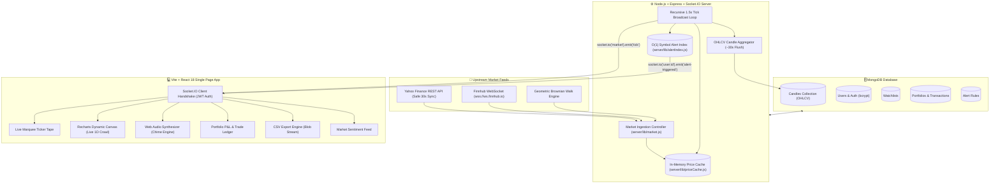

<div align="center">

# ⚡ TICKER ROOM
### Production-Grade Real-Time Stock Market Dashboard & Paper Trading Platform

[](https://nodejs.org)
[](https://expressjs.com)
[](https://reactjs.org)
[](https://socket.io)
[](https://mongodb.com)
[](https://vitejs.dev)
[](https://github.com)

<p align="center">
  <b>A blazing-fast, institutional-grade full-stack market platform.</b><br>
  Engineered with in-memory caching, non-blocking asynchronous market loops, $O(1)$ indexed alert evaluations, live WebSocket feeds, Web Audio alert synthesis, and interactive marked-to-market paper trading.
</p>

[Key Features](#-key-features) • [Architecture](#-system-architecture) • [Codebase Deep Dive](CODEBASE_DEEP_DIVE.md) • [Quick Start](#-quick-start) • [Live vs Simulated](#-real-time-market-feeds) • [API Reference](#-api--socket-specifications)

---

</div>

## 🚀 Key Features

* **⚡ Real-Time Market Streaming Tape**: Sub-1.5s live market price broadcasts over Socket.IO directly to connected browsers without polling or page refreshes.
* **🌐 Multi-Source Ingestion Engine**: Seamlessly switch between real live **Yahoo Finance**, **Finnhub native WebSockets**, or a **Brownian-motion simulated engine** with zero frontend reconfiguration.
* **🎯 High-Performance $O(1)$ Threshold Alerts**: Price alerts indexed by symbol in memory (`Map<symbol, Map<alertId, alert>>`), evaluating thousands of rules per tick without hitting the database.
* **🔔 Web Audio Synthesized Chimes**: Native dual-tone synthesizer alert chime (880Hz primary + 1320Hz overtone) that rings the moment a price alert fires.
* **🔍 Global Autocomplete Search**: Instantly filter and navigate across 37 seeded stocks and corporate sectors.
* **📈 Dynamic Intraday & Historical Charts**: Interactive timeframe selection (`1D`, `1W`, `3M`, `6M`) backed by real 1-minute OHLCV candles with SMA(10) momentum indicators.
* **💼 Paper-Trading Portfolio**: Virtual ₹10,00,000 cash account with live marked-to-market P&L, integer share validation, and full execution history logs.
* **📥 1-Click CSV Data Exports**: Instant client-side generation and download of formatted `.csv` spreadsheets for both Watchlists and Portfolios.
* **📰 Market Intelligence & Sentiment Feed**: Real-time financial headlines with an automated sentiment meter (`Bullish`, `Bearish`, `Neutral`) and clickable `$TICKER` mentions.
* **⚡ 1-Click Instant Demo Login**: Frictionless single-click evaluator authentication into a fully primed demo workspace.

---

## 🏛️ System Architecture

Ticker Room decouples upstream market ingestion from client broadcasting. Current prices live in an ultra-fast in-memory hot cache, preventing high-frequency ticks from hammering MongoDB. Aggregated 1-minute OHLCV candles are periodically flushed for persistent historical analytics.



---

## 📦 Project Structure

```
stock-market-dashboard/
├── client/                     # Vite + React 18 Frontend
│   ├── src/
│   │   ├── components/         # Reusable UI & Widget Components
│   │   │   ├── Layout.jsx      # Navigation, Global Search Bar, Sound Toggle
│   │   │   ├── MarketNews.jsx  # Intelligence Feed & Sentiment Gauge
│   │   │   ├── TickerTape.jsx  # Live Crawling Top Marquee
│   │   │   └── ui.jsx          # Panels, Index Tickers, Tables, Sparklines
│   │   ├── pages/              # Primary App Views
│   │   │   ├── Alerts.jsx      # Threshold Price Alert Management
│   │   │   ├── Auth.jsx        # JWT Authentication + 1-Click Demo Login
│   │   │   ├── Dashboard.jsx   # Market Overview, Movers & Dynamic Heatmap
│   │   │   ├── Portfolio.jsx   # Paper Trading, Holdings & Transaction Log
│   │   │   ├── StockDetail.jsx # Interactive Charts, Timeframes & SMA(10)
│   │   │   └── Watchlist.jsx   # Watchlist with Quick Add & CSV Export
│   │   ├── utils/
│   │   │   ├── audio.js        # Web Audio API Synthesizer Chime
│   │   │   └── exportCsv.js    # Client-Side CSV Exporter
│   │   ├── api.js              # REST Client (Fetch API wrapper)
│   │   ├── socket.js           # Socket.IO Client Configuration
│   │   └── styles.js           # Premium Obsidian Dark Design Tokens
├── server/                     # Express.js + Socket.IO Backend
│   ├── lib/
│   │   ├── alertIndex.js       # O(1) Memory-Indexed Alert Evaluation
│   │   ├── auth.js             # JWT REST & Socket Middleware
│   │   ├── market.js           # Live Yahoo/Finnhub/Simulated Ingestion Engine
│   │   ├── mongo.js            # Mongoose Connection Management
│   │   ├── priceCache.js       # Ultra-Fast In-Memory Price Cache
│   │   └── seed.js             # Idempotent 37-Stock & 6,600+ Candle Seeder
│   ├── models/                 # Mongoose Data Models
│   │   ├── Alert.js            # User Price Trigger Schema
│   │   ├── Candle.js           # 1-Minute OHLCV Long-Term History
│   │   ├── Portfolio.js        # Cash Balances, Positions & Transactions
│   │   ├── Stock.js            # Equity Metadata & Rolling Sparkline Buffer
│   │   ├── User.js             # User Accounts (bcrypt hashes)
│   │   └── Watchlist.jsx       # User Selected Symbols
│   └── routes/                 # REST API Endpoints
│       ├── alertRoutes.js      # CRUD Alert Rules
│       ├── authRoutes.js       # Register, Login & Starter Kits
│       ├── newsRoutes.js       # Market News & Sentiment Analysis
│       ├── portfolioRoutes.js  # Atomic Buy/Sell Trading & Trade Logs
│       ├── stockRoutes.js      # Equity Snapshots & Stored Candle Analytics
│       └── watchlistRoutes.js  # Add / Remove Tracked Symbols
└── package.json                # Root Concurrently Orchestrator
```

---

## ⚡ Quick Start

### 1. Prerequisites
* **Node.js 18+** installed (`node -v`)
* **MongoDB** instance running locally (`mongodb://127.0.0.1:27017/stockdash`) or a [MongoDB Atlas](https://www.mongodb.com/atlas) connection URI.

### 2. Installation
Clone the repository and install all dependencies (root, server, and client) in one shot:
```bash
git clone https://github.com/SriVishnu230707/stock-market-dasboard.git
cd stock-market-dasboard
npm install
npm run install:all
```

### 3. Environment Configuration
Create your environment file in `server/.env`:
```bash
cp server/.env.example server/.env
```
*(The default configuration points to local MongoDB and live Yahoo Finance data out of the box).*

```env
MONGO_URI=mongodb://127.0.0.1:27017/stockdash
JWT_SECRET=your-secure-jwt-secret-key
PORT=4000
CLIENT_ORIGIN=http://localhost:5173
MARKET_DATA_PROVIDER=yahoo
```

### 4. Run the Full Application
Start both the backend and frontend simultaneously with color-coded logs:
```bash
npm run dev
```

Open **[http://localhost:5173](http://localhost:5173)** in your browser, hit **"Instant 1-Click Demo Login"**, and experience the live market tape!

---

## 🌐 Real-Time Market Feeds

You can switch the market data provider in `server/.env` without touching the frontend:

| Provider | Setting | Description |
| :--- | :--- | :--- |
| **Yahoo Finance (Default)** | `MARKET_DATA_PROVIDER=yahoo` | **Zero API key required.** Pulls real live prices and intraday close points for all 37 equities with throttled 30s background syncing. |
| **Finnhub WebSocket** | `MARKET_DATA_PROVIDER=finnhub`<br>`MARKET_DATA_API_KEY=your_key` | Subscribes to Finnhub's native WebSocket (`wss://ws.finnhub.io`) for sub-second live trade updates on US equities. |
| **Simulated Walk** | `MARKET_DATA_PROVIDER=simulated` | Realistic offline random walk model utilizing geometric Brownian motion and volatility clustering with mean reversion. |

---

## 🛠️ API & Socket Specifications

### REST Endpoints
| Endpoint | Method | Auth | Description |
| :--- | :---: | :---: | :--- |
| `/api/health` | `GET` | No | Server health check, active stock count, and feed telemetry. |
| `/api/auth/register` | `POST` | No | Creates account, hashes password, primes starter watchlist & portfolio. |
| `/api/auth/login` | `POST` | No | Authenticates user credentials and returns signed 7-day JWT. |
| `/api/stocks` | `GET` | Yes | Snapshot of all 37 tracked equities with price and percentage change. |
| `/api/stocks/:symbol/chart` | `GET` | Yes | Returns real MongoDB candles or intraday ticks for `1d`, `1w`, `3m`, `6m`. |
| `/api/watchlist` | `GET` | Yes | Returns the authenticated user's tracked symbols. |
| `/api/watchlist/:symbol` | `POST` | Yes | Adds a symbol to the user's persistent watchlist. |
| `/api/watchlist/:symbol` | `DELETE`| Yes | Removes a symbol from the user's watchlist. |
| `/api/alerts` | `GET` | Yes | Lists all active and triggered price alerts for the user. |
| `/api/alerts` | `POST` | Yes | Registers a new threshold rule (`above`/`below`) into the memory index. |
| `/api/portfolio` | `GET` | Yes | Returns portfolio balances, marked-to-market P&L, and transaction logs. |
| `/api/portfolio/buy` | `POST` | Yes | Atomic buy execution: verifies cash balance, computes average cost basis. |
| `/api/portfolio/sell` | `POST` | Yes | Atomic sell execution: verifies share availability, credits cash. |
| `/api/news` | `GET` | Yes | Returns market headlines, sentiment scores, and related tickers. |

### Socket.IO Real-Time Events
* **`tick`**: Broadcasted to room `"market"` every 1.5 seconds with current snapshots of all stocks.
* **`market-status`**: Broadcasted to room `"market"` reporting active feed type and connection status.
* **`alert-triggered`**: Emitted privately to room `"user:${userId}"` the instant an equity price crosses a user's defined target threshold.

---

## 🧪 Testing

Run the automated test suite on the backend:
```bash
cd server
npm test
```
*Validates ticker normalization, market configuration resolution, price cache initialization, timestamps, and percentage drift calculations.*

Verify production frontend compilation:
```bash
cd client
npm run build
```

---

## 📄 License
This project is open source and available under the [MIT License](LICENSE).
